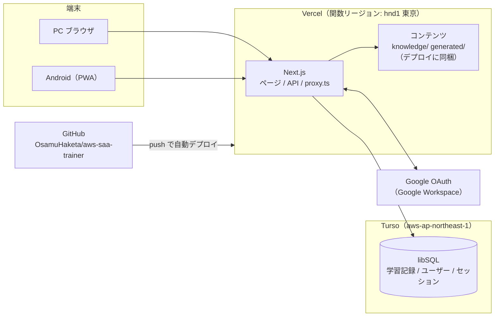

# クラウド化 設計書

作成: 2026-09-26 / 対象: AWS Decision Trainer（このリポジトリ）

| 版 | 日付 | 内容 |
|---|---|---|
| 1 | 2026-09-26 | 初版 |
| 2 | 2026-09-26 | レビューを反映。ログイン許可の判定を `validateUserInfo` とリクエストごとの確認にした（7 章）、コンテンツをビルド時にまとめる（4.2）、本番のマイグレーションのルール（6.3）、外部キーとインデックス（6.2）、ID を保ったままの移行（9 章）、バックアップ（10 章） |
| 3 | 2026-09-26 | 実装に合わせて更新。ローカル専用モード（7.5）、ローカルのマイグレーションは `instrumentation.ts` で適用（6.3）、既存の記録の持ち主 `local-owner`（6.2） |

## 1. 目的とスコープ

ローカル専用の学習アプリを、PC とスマホ（Android）のどちらからでも使え、**学習記録が 1 か所にまとまる**ようにする。あわせて、将来**社内のエンジニアにテスト公開する**ときに作り直しが要らない構成にしておく。

| フェーズ | 内容 | 利用者 |
|---|---|---|
| Phase 1: 個人クラウド化 | Vercel + Turso にデプロイ。Google ログイン。PWA としてスマホのホーム画面に追加できる | 自分だけ |
| Phase 2: 社内テスト公開 | ログインを許可する範囲を `@xincere.jp` に広げる。ホスティングを商用利用できるプランに移す | 社内のエンジニア（数十人を想定） |

Phase 1 の段階で、データモデルと認証は複数ユーザーに対応させておく。Phase 2 では設定の変更とホスティングの移行だけで済むようにする。

### スコープ外

- オフラインでの学習（出題と記録はサーバーで行うので、オンラインが前提）
- ネイティブアプリ（Google Play での配布）。必要になれば、同じ URL を TWA / Capacitor で包めば対応できる
- 問題の編集画面（問題はこれまでどおりリポジトリの `knowledge/`・`generated/` で管理する）

## 2. 現状

| 項目 | 現状 |
|---|---|
| フレームワーク | Next.js 16（App Router）、React 19 |
| DB | ローカルの SQLite（`local.db`、better-sqlite3、同期 API）、Drizzle ORM |
| ユーザー | 区別がない（1 人用） |
| 認証 | なし |
| コンテンツ | `knowledge/*.yaml`（Atom）と `generated/*.json`（問題）を**リクエストのたびにファイルから読み**、更新日時が変わったら読み直す |
| マイグレーション | DB を開くときに自動で適用する |

## 3. 環境構成



### 3.1 環境の一覧

| 環境 | ブランチ | URL | DB | 用途 |
|---|---|---|---|---|
| ローカル | 任意 | `http://localhost:3000` | `file:local.db`（ローカルの SQLite ファイル） | 開発、問題の編集 |
| プレビュー | `develop` | `https://aws-saa-trainer-git-develop-<team>.vercel.app`（ブランチごとに固定の URL） | Turso `saa-trainer-dev` | 本番に出す前の確認 |
| 本番 | `main` | `https://aws-saa-trainer.vercel.app`（独自ドメインは任意） | Turso `saa-trainer-prod` | 普段の学習 |

- プレビューは、ブランチごとに固定される URL を Google OAuth のリダイレクト URI に登録する（デプロイごとに変わる URL ではログインできないため）
- Vercel の関数リージョンは東京（`hnd1`）、Turso も東京（`aws-ap-northeast-1`）にそろえて、DB との往復を短くする
- ローカルも Turso と同じ libSQL ドライバで `file:` の URL を使う。ドライバは 1 種類だけにする

### 3.2 環境変数

| 変数 | 内容 | ローカル | プレビュー / 本番 |
|---|---|---|---|
| `DATABASE_URL` | libSQL の URL | `file:local.db` | `libsql://saa-trainer-<env>-<org>.turso.io` |
| `DATABASE_AUTH_TOKEN` | Turso のトークン | 不要 | 必須 |
| `BETTER_AUTH_SECRET` | セッションの署名鍵（32 バイト以上のランダム値） | 必須 | 必須（環境ごとに別の値） |
| `BETTER_AUTH_URL` | アプリの公開 URL | `http://localhost:3000` | 各環境の URL |
| `GOOGLE_CLIENT_ID` / `GOOGLE_CLIENT_SECRET` | Google OAuth クライアント | 必須 | 必須 |
| `ALLOWED_EMAILS` | ログインを許可するメールアドレス（カンマ区切り） | 自分 | Phase 1: 自分 |
| `ALLOWED_DOMAINS` | ログインを許可するドメイン（カンマ区切り） | 空 | Phase 2: `xincere.jp` |

`.env.local` は Git に入れない。Vercel では環境変数を Preview と Production で分けて登録する。

- どの変数にも `NEXT_PUBLIC_` を付けない（ブラウザに渡るバンドルに含めないため）
- `lib/db/` と `lib/auth/` の先頭で `import "server-only"` し、クライアントのコンポーネントから誤って読み込むとビルドエラーになるようにする
- ブラウザや PWA から Turso に直接つなぐことはしない。DB には必ず Next.js のサーバー側の処理を通してアクセスする

### 3.3 費用（Phase 1）

| サービス | プラン | 費用 | 上限の目安 |
|---|---|---|---|
| Vercel | Hobby | 無料 | 個人の非商用利用に限る |
| Turso | Free | 無料 | 1 人分の学習記録なら上限に届かない |
| Google Cloud（OAuth のみ） | — | 無料 | — |
| GitHub | Free（private リポジトリ） | 無料 | — |

## 4. 技術構成

| 領域 | 採用するもの | 理由 |
|---|---|---|
| フレームワーク | Next.js 16（App Router） | 現状のまま |
| ホスティング | Vercel | Next.js をそのまま動かせる。GitHub への push で自動デプロイ、ブランチごとにプレビューが作られる |
| DB | Turso（libSQL） | SQLite 互換なので、今のスキーマと Drizzle をそのまま使える。無料枠がある |
| DB ドライバ | `@libsql/client` + `drizzle-orm/libsql` | better-sqlite3 はネイティブモジュールで、サーバーレスでは使いにくいため置き換える。変更の範囲を小さくするため、Turso の新しいドライバへの移行は Phase 1 では同時に行わない |
| ORM / マイグレーション | Drizzle ORM / drizzle-kit | 現状のまま |
| 認証 | Better Auth（Google プロバイダ） | ユーザーとセッションを自前の DB（Turso）に保存できる。Drizzle アダプタがある。ログインのたびに許可を判定できる（`validateUserInfo`）。無料 |
| ログイン | Google OAuth（Google Workspace） | 社内のアカウントでそのままログインできる |
| アクセス制御 | `proxy.ts`（未ログインならログイン画面へ）＋ サーバー側の `requireUser()` | Next.js 16 の推奨の形。proxy は簡易チェックで、本当の確認はデータを読む側で行う |
| PWA | `app/manifest.ts` ＋ アイコン | Next.js 標準のマニフェスト機能を使う。Service Worker はオフライン対応をしないので、最小限にとどめる |
| スケジューリング | ts-fsrs | 現状のまま |
| テスト | Vitest（DB は libSQL の `:memory:`） | 現状のまま |

### 4.1 DB アクセスの非同期化

better-sqlite3 は同期 API（`.all()`・`.get()`・`.run()`）だが、libSQL は非同期なので、DB を触る関数をすべて `async` にする。

| ファイル | 変更 |
|---|---|
| `lib/db/index.ts` | `openDb` を libSQL 用に書き換える。起動時の自動マイグレーションはローカルだけで行う |
| `lib/study.ts` | `loadCards`・`loadState`・`getNextQuestion`・`getQueueSummary`・`recordReview`・`todayStats` を async にし、`userId` を引数に加える。`recordReview` のトランザクションは `await db.transaction(async (tx) => …)` にする |
| `lib/stats.ts` | `dashboard`・`latestResults` を async にし、`userId` で絞り込む |
| `lib/scheduler.ts`・`lib/mastery.ts`・`lib/fsrs.ts` | 変更なし（DB を触らない純粋関数） |
| `app/**/page.tsx`・`app/api/**/route.ts` | `await` を付け、セッションから取った `userId` を渡す |

### 4.2 コンテンツの配信

問題と Atom はこれまでどおりリポジトリのファイルを正本とする。DB には移さず、本番から問題を編集する管理画面も作らない。**ビルド時に 1 つのファイルにまとめて、デプロイに同梱する**。

```text
knowledge/*.yaml ─┐
                  ├─ npm run build-content ─→ .generated/content.json ─→ デプロイに同梱
generated/*.json ─┘   （検証 → 並び替え → 書き出し）
```

- `npm run build-content`（`scripts/build-content.ts`）で、今の `parseContent()` と同じ検証と並び替えを行い、`.generated/content.json` に書き出す。エラーがあればビルドを止める。`package.json` の `prebuild` で自動で実行する
- 本番とプレビューでは、`getContent()` が `.generated/content.json` を読む。YAML の解析やファイルの一覧取得は実行時には行わない。関数のバンドルに含めるファイルは、`next.config.ts` の `outputFileTracingIncludes` でこの 1 ファイルだけ指定すればよい
- 読み込んだ内容は、**Vercel の関数のインスタンスごとに**、最初のアクセス時に読み込み、そのインスタンスが生きている間だけメモリに保持する。コールドスタートや別のインスタンスでは読み直しになる前提で作る（ファイル 1 つを読むだけなので軽い）
- ローカル（`NODE_ENV=development`）では、今までどおり `knowledge/`・`generated/` を直接読み、更新日時が変わったら読み直す（問題を直してすぐ確認できるように）
- `.generated/` は Git に入れない

問題を直す流れ: `generated/*.json` を編集 → `npm run validate` → develop に push（プレビューで確認）→ main にマージ（本番に反映）。Git に履歴が残るので、問題のレビューや元に戻す作業がしやすく、DB のマイグレーションとも切り離せる。

## 5. 機能一覧

### 5.1 既存の機能（変更なし）

| 機能 | 内容 |
|---|---|
| 4 択の出題 | Atom から作った問題を FSRS の間隔反復で出す。出題の優先順位は 混同フォローアップ → 学習中 → 復習 → 新規 → 前倒し |
| 回答の記録 | 正誤、「勘だった」、間違えた理由（5 種類）、回答時間、選んだ選択肢（混同相手の Atom） |
| 混同フォローアップ | 誤答で別の Atom を選んだとき、2 問後にその 2 つを見分ける問題を出す |
| 範囲の絞り込み | 特定のサービスだけで学習する |
| ホーム | 今日の復習待ち、新規の残り、正答率 |
| 分析 | カテゴリ別・問題タイプ別の正答率、混同ペア、苦手な Atom |
| 知識 | Atom の一覧と各問題の最新の結果 |
| キーボード操作 | `1`〜`4`・`Enter`・`G`・`Q W E R T` |

### 5.2 追加する機能

| 機能 | フェーズ | 内容 |
|---|---|---|
| Google ログイン | 1 | Google Workspace のアカウントでログインする。許可リスト（メールアドレス／ドメイン）にないアカウントは拒否する |
| ログアウト | 1 | ヘッダーのメニューから |
| ユーザーごとの学習記録 | 1 | FSRS の状態、回答ログ、フォローアップをすべてユーザー単位で持つ |
| PWA | 1 | Android の Chrome で「ホーム画面に追加」すると、アドレスバーのない単独のアプリとして開く |
| スマホ向けの画面 | 1 | 回答ボタンを指で押しやすい大きさにする。表は横スクロールにする。キーボード操作は PC 向けに残す |
| ローカルの記録の移行 | 1 | 今の `local.db` の記録を、本番の自分のユーザーに取り込むスクリプト（1 回だけ使う） |
| ユーザーごとの設定 | 2（候補） | 新規の問題数/日、目標保持率を各自で変える。今は `lib/config.ts` の全員共通の値 |
| フィードバック | 2（候補） | 問題の誤りを報告するボタン。報告は DB に保存し、開発者が確認する |
| 利用状況の確認 | 2（候補） | 開発者向けに、利用者数と回答数を見る画面 |

### 5.3 画面と API

| パス | 種別 | ログイン | 内容 |
|---|---|---|---|
| `/login` | 画面 | 不要 | 「Google でログイン」ボタンだけ。許可されていないアカウントのときはその旨を表示する |
| `/` | 画面 | 必要 | ホーム |
| `/study` | 画面 | 必要 | 学習（`?service=` で範囲を絞る） |
| `/dashboard` | 画面 | 必要 | 分析 |
| `/knowledge` | 画面 | 必要 | 知識 |
| `/api/auth/*` | API | — | Better Auth（OAuth のコールバック、セッション） |
| `/api/next` | API | 必要 | 次の問題を返す |
| `/api/review` | API | 必要 | 回答を記録する |
| `/manifest.webmanifest` | 静的 | 不要 | PWA のマニフェスト |

## 6. データモデル

### 6.1 認証のテーブル（Better Auth が使う）

| テーブル | 主な列 |
|---|---|
| `user` | `id`、`email`、`name`、`image`、`created_at` |
| `session` | `id`、`user_id`、`token`、`expires_at` |
| `account` | `id`、`user_id`、`provider_id`（`google`）、`account_id` |
| `verification` | Better Auth の内部用 |

列の詳細は Better Auth の CLI で生成したスキーマに合わせる。

### 6.2 学習記録のテーブル（既存を変更）

すべてのテーブルに `user_id` を追加する。

| テーブル | 変更 |
|---|---|
| `cards` | `user_id` を追加。主キーを `question_id` から **(`user_id`, `question_id`)** に変える。同じ問題でも、ユーザーごとに別の FSRS の状態を持つ |
| `review_logs` | `user_id` を追加。`(user_id, answered_at)` にインデックスを張る |
| `followups` | `user_id` を追加。未解決のものを探すための部分インデックス `ON followups(user_id) WHERE resolved_at IS NULL` を張る |

- 3 つのテーブルの `user_id` には、`user(id)` への外部キーを `ON DELETE CASCADE` で張る。ユーザーを消すと学習記録も消える
  - Phase 2 で、退職者などの削除したユーザーの統計を残したくなった場合は、社内公開の前に CASCADE をやめるかどうか見直す
  - SQLite の外部キーは `PRAGMA foreign_keys = ON` のときだけ効く。`@libsql/client` はローカル（ファイル / メモリ）では既定で有効になっていることを確認した（トランザクションの中でも有効）。Turso 上ではデプロイのときに確認する
- ユーザーの区別がなかったころの記録は、マイグレーション（`drizzle/0001_users_and_auth.sql`）で持ち主ユーザー `local-owner` に割り当てる。このユーザーは記録が 1 件以上ある DB にだけ作るので、Turso の新しい DB には作られない
- ユーザー ID は必ずセッションから取る。クエリパラメータ、リクエストのボディ、フォーム、クライアントの状態からは受け取らない
- 学習記録を読み書きする関数は、すべて `userId` を必須の引数にする（絞り込みの漏れを型で防ぐ）
- インデックスは、実際のクエリプランを見て過不足があれば調整する

### 6.3 マイグレーション

- スキーマの変更は、これまでどおり `npm run db:generate` でマイグレーションを作る
- ローカルは、サーバーの起動時に `instrumentation.ts` の `register()` で自動で適用する（`register()` はリクエストを受け付ける前に 1 回だけ呼ばれる。Better Auth に DB を同期で渡すため、DB の接続自体は同期で作る）
- プレビューと本番の DB には、`npm run db:migrate`（`DATABASE_URL` に対象の DB を指定）で手動で適用してからデプロイする。サーバーレスでは起動のたびにマイグレーションを確認するのは無駄なので、自動適用はしない
- 本番のスキーマ変更は、**変更前のアプリのままでも動く形（後方互換）**にする。マイグレーションを適用してから新しいアプリのデプロイが終わるまでの間は、古いアプリが新しいスキーマで動くため
- 列の削除や名前の変更を 1 回のマイグレーションで行わない。Expand → Migrate → Contract の順に進める

```text
1. 新しい列を追加する（Expand）
2. 新旧どちらの列でも動くアプリをデプロイする
3. 既存のデータを新しい列に移す（Migrate）
4. 古い列を参照している箇所がないことを確認する
5. 後日のマイグレーションで古い列を消す（Contract）
```

- 本番のマイグレーションの前には、10 章のバックアップを取る

## 7. 認証とアクセス制御

### 7.1 ログインの流れ

1. 未ログインで任意のページを開く → `proxy.ts` がセッションの Cookie がないことを確認し、`/login` にリダイレクトする
2. 「Google でログイン」→ Google の同意画面 → `/api/auth/callback/google`
3. Better Auth の `user.validateUserInfo` で、Google から受け取ったユーザー情報を確認する。これは初回のユーザー作成時だけでなく、**既存ユーザーが再ログインするとき**にも、Google から受け取った最新のメールアドレスで呼ばれる
   - `ALLOWED_EMAILS` に含まれる、または `ALLOWED_DOMAINS` のドメインで、かつ Google がメールアドレスを確認済み（`email_verified`）であること。メールアドレスは小文字にそろえて比べる
   - 当てはまらなければ `{ error }` を返して拒否し、`/login?error=not_allowed` に戻す。エラーの説明はブラウザに返るので、内部の情報は書かない
   - 判定は `lib/auth/allowlist.ts` の `isAllowed(email)` にまとめ、ユーザーの作成とは切り離す（7.2 の `requireUser()` からも使う）
4. セッションの Cookie（`HttpOnly`・`Secure`・`SameSite=Lax`）を発行する。有効期限は 30 日で、使うたびに延長する。スマホでも一度ログインすれば、ほぼログインし直す必要はない

```ts
// lib/auth/index.ts（イメージ）
user: {
  validateUserInfo: async ({ user }) => {
    if (!isAllowed(user.email)) return { error: "not_allowed" };
  },
},
```

### 7.2 確認する場所

```text
リクエスト
  → proxy.ts: セッションの Cookie があるかだけ見る（DB は見ない）
  → ページ / API
  → requireUser(): DB でセッションを確認し、isAllowed(email) も確認する
  → user.id で学習記録を読み書きする
```

| 場所 | 確認の内容 |
|---|---|
| `proxy.ts` | Cookie があるかだけを見る。未ログインの人を `/login` に案内するための簡易チェックで、セキュリティ上の判定はしない |
| `lib/auth/session.ts` の `requireUser()` | DB でセッションを確認し、さらに `isAllowed(user.email)` を確認してからユーザーを返す。だめならページは `/login` へリダイレクト、API は 401（許可リストから外れた場合は 403）を返す |
| 各ページと API | 最初に `requireUser()` を呼び、その `user.id` で学習記録を読み書きする |

`requireUser()` でも許可リストを確認するので、許可リストから外した人は、30 日のセッションが残っていても次のリクエストから使えなくなる（Phase 2 で退職や異動があったとき用）。

### 7.3 アクセス制御の二重化（Phase 2）

```text
Google Workspace（OAuth アプリを「内部」にする）→ 組織内のアカウントしか同意画面に進めない
  → Better Auth の validateUserInfo → ALLOWED_DOMAINS / ALLOWED_EMAILS
  → requireUser() → リクエストごとに許可リストを再確認
```

### 7.4 Google OAuth クライアントの設定

| 項目 | Phase 1 | Phase 2 |
|---|---|---|
| Google Cloud プロジェクト | 個人のプロジェクト | 会社の Google Cloud プロジェクトに作り直すのが望ましい |
| ユーザーの種類 | 外部（テストモード。テストユーザーに自分を登録） | **内部**（Workspace の組織内のアカウントだけがログインできる） |
| リダイレクト URI | ローカル、プレビュー、本番の 3 つ | 本番（とプレビュー） |
| スコープ | `openid`、`email`、`profile` のみ | 同じ |

テストモードでは Google のリフレッシュトークンが 7 日で切れるが、このアプリは Google の API を呼ばず、ログインの確認にしか使わないので影響はない。

### 7.5 ローカル専用モード

Google の OAuth クライアントを作る前でも、今までどおりローカルで学習できるようにする。次の 3 つがすべてそろったときだけ、ログインせずに `local-owner` として使える（`lib/auth/local-owner.ts`）。

- `NODE_ENV=development`（`npm run dev`）
- DB がローカル（`file:` または `:memory:`）
- `GOOGLE_CLIENT_ID` が未設定

本番のビルドは `NODE_ENV=production` なので、Vercel では必ず無効になる。`GOOGLE_CLIENT_ID` を設定すれば、ローカルでも Google ログインを試せる。

## 8. PWA

| 項目 | 内容 |
|---|---|
| マニフェスト | `app/manifest.ts`。`name`: AWS Decision Trainer、`short_name`: SAA Trainer、`display`: `standalone`、`start_url`: `/study`、`theme_color` / `background_color` は今の画面の色に合わせる |
| アイコン | `public/icons/` に 192×192 と 512×512、maskable の 512×512。元の絵は `public/icons/icon.svg`（4 択の 2×2 のうち 1 つが正解の形）。ファビコンは `app/icon.svg`、iOS 用は `app/apple-icon.png` |
| Service Worker | 置かない、または最小限（キャッシュはしない）。学習の処理はサーバーと DB に依存しているので、中途半端にオフラインのキャッシュを入れると、端末・サーバー・Turso の間でデータの整合性を管理する手間が増える。オフラインでの学習が必要になったら、IndexedDB・同期キュー・競合の解決を含めて別のフェーズとして設計する |
| インストール | Android の Chrome で開き、メニューの「ホーム画面に追加」または「アプリをインストール」 |
| HTTPS | Vercel で自動 |

## 9. 既存の学習記録の移行

今の `local.db` にある学習記録を本番に持っていく。

1. 本番に一度ログインして、自分の `user.id` を作る。**移行が終わるまで、本番では学習しない**（`review_logs` と `followups` を空のままにしておくため）
2. `scripts/import-local.ts` を実行する。`local.db` の `cards`・`review_logs`・`followups` を読み、`user_id` を付けて本番の Turso に書き込む
   - `review_logs.id` と `followups.id` は**振り直さず、そのまま入れる**。`followups.source_log_id` と `review_logs.followup_id` の対応がそのまま保たれる
   - 書き込む前に、本番の `review_logs` と `followups` が空であること（ID がぶつからないこと）を確認し、空でなければ中止する
   - 1 つのトランザクションで書き込み、途中で失敗したらすべて取り消す
3. 移行後に、次がローカルと一致することを確認する（スクリプトの最後で件数は自動で比べる）
   - `cards`・`review_logs`・`followups` の件数
   - ホームの復習待ちの件数、分析画面の回答の総数と正答率、未解決のフォローアップの数

## 10. 学習記録のバックアップ

問題のデータは GitHub にあるので作り直せるが、`cards`・`review_logs`・`followups` は作り直せない。そのため、問題よりも学習記録のバックアップを重視する。Turso のポイントインタイムリカバリだけには頼らない。

| 項目 | 内容 |
|---|---|
| コマンド | `npm run backup`（`scripts/backup.ts`）。`DATABASE_URL` の DB から、3 つのテーブルと `user` を JSON で書き出す |
| 出力先 | `backups/<日付>/cards.json`・`review_logs.json`・`followups.json`・`users.json`。`backups/` は Git に入れない |
| 頻度 | Phase 1: 週 1 回（手動）と、本番のマイグレーションの直前。Phase 2: 利用人数に応じて見直す（GitHub Actions などで定期実行するかどうかも含めて） |
| 復元 | 9 章の移行スクリプトと同じ形式で読み込めるようにして、バックアップからの復元にも使えるようにする |
| Turso の PITR | 無料プランで何日前まで戻せるかを確認し、この章に書き足す |

## 11. Phase 2: 社内テスト公開

| 作業 | 内容 |
|---|---|
| ホスティング | Vercel Hobby は商用利用できない（従業員として使う場合も商用とみなされる）ので、次のどちらかに移す。**A. Vercel Pro**（月 $20/人。料金がかかるのはデプロイする側だけ）、**B. 会社の AWS の Amplify Hosting**（Next.js をそのまま動かせる。社内の費用で管理できる）。コードは標準的な Next.js・環境変数・Turso だけに依存させ、Vercel 固有の機能を増やさないことで、どちらにも移せるようにする |
| DB | Turso をそのまま使う。社内公開の前に Turso の規約（商用利用）と、会社のデータの置き場所に関するルールを確認する |
| ログイン | `ALLOWED_DOMAINS=xincere.jp` にする。OAuth クライアントを会社の Google Cloud に作り直し、ユーザーの種類を「内部」にする（7.3 の二重のアクセス制御） |
| バックアップ | 頻度を見直す（10 章） |
| コンテンツ | 問題の `status: draft` をレビューし、公開してよい問題だけにする |
| 候補の機能 | ユーザーごとの設定、フィードバック、利用状況（5.2 を参照） |
| 周知 | URL とインストール方法（PWA）を案内するだけ。アプリストアは使わない |

## 12. 作業の順番（Phase 1）

| # | 作業 | 担当 |
|---|---|---|
| 1 | DB ドライバを libSQL に替え、DB を触る関数を非同期にする（ローカルは `file:local.db`）。既存のテストをすべて通す | Claude |
| 2 | 学習記録のテーブルに `user_id`・外部キー・インデックスを追加し、DB を触る関数すべてで `userId` を必須にする | Claude |
| 3 | Better Auth を入れ、`user`・`session`・`account`・`verification` を Drizzle で管理する。Google ログインとログイン画面 | Claude |
| 4 | アクセス制御: `validateUserInfo`、`isAllowed()`（`ALLOWED_EMAILS` / `ALLOWED_DOMAINS`）、`proxy.ts`、`requireUser()` | Claude |
| 5 | コンテンツをビルド時にまとめる（`npm run build-content`）。本番ではそれを読む | Claude |
| 6 | PWA（マニフェスト、アイコン）とスマホ向けの画面の調整 | Claude |
| 7 | バックアップ（`npm run backup`）と移行スクリプト（`scripts/import-local.ts`） | Claude |
| 8 | Turso の DB（dev / prod）を作り、トークンを発行する | ユーザー |
| 9 | Google Cloud で OAuth クライアントを作る（リダイレクト URI: ローカル、プレビュー、本番） | ユーザー |
| 10 | Vercel にリポジトリをつなぎ、関数リージョンを `hnd1` にし、環境変数を登録する。develop をプレビューで確認 → main にマージして本番に出す | 両方 |
| 11 | `local.db` の記録を本番に移し、件数と画面の数値を確認する。最初のバックアップを取る | Claude（スクリプト）＋ ユーザー（実行） |

8〜10 のコマンドや画面での手順は、1〜7 が終わった時点で別にまとめる。

## 13. リスクと未決事項

| 項目 | 内容 | 対応 |
|---|---|---|
| Vercel Hobby の商用利用の制限 | 社内公開は Hobby ではできない | Phase 2 でホスティングを移す（11 章） |
| Google Workspace の管理ポリシー | 会社の管理者が、外部アプリでの Google ログインを制限していることがある | Phase 1 は個人の Google アカウントでもログインできるよう、`ALLOWED_EMAILS` に個人のアドレスも入れられるようにしておく |
| DB のレイテンシ | 1 回の回答で複数のクエリが走る | Vercel と Turso を同じ東京にそろえる。遅ければ、1 リクエストで読む量を減らす |
| コールドスタート | しばらく使わないと、最初の表示が 1〜2 秒遅い | 個人利用では許容する |
| 問題の中身が見える範囲 | ログインした人には全問題が見える | Phase 2 の前にレビューを終える |
| 学習記録の消失 | Turso の障害、操作ミス、マイグレーションの誤り | Turso のポイントインタイムリカバリを使うとともに、`cards`・`review_logs`・`followups` を定期的に書き出す（10 章） |
| デプロイ中のスキーマの食い違い | マイグレーションの適用からデプロイ完了までの間、古いアプリが新しいスキーマで動く | スキーマ変更は後方互換にする（6.3） |
