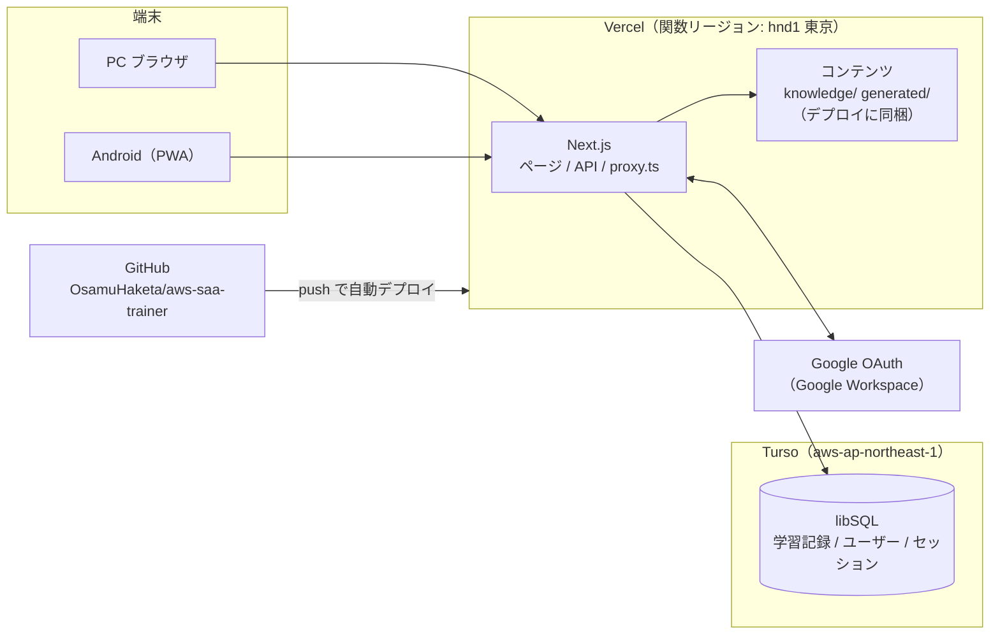

# クラウド化 設計書

作成: 2026-09-26 / 対象: AWS Decision Trainer（このリポジトリ）

## 1. 目的とスコープ

ローカル専用の学習アプリを、PC とスマホ（Android）のどちらからでも使え、**学習記録が 1 か所にまとまる**ようにする。あわせて、将来**社内のエンジニアにテスト公開する**ときに作り直しが要らない構成にしておく。

| フェーズ | 内容 | 利用者 |
|---|---|---|
| Phase 1: 個人クラウド化 | Vercel + Turso にデプロイ。Google ログイン。PWA としてスマホのホーム画面に追加できる | 自分だけ |
| Phase 2: 社内テスト公開 | ログインを許可する範囲を `@xincere.jp` に広げる。ホスティングを商用利用できるプランに移す | 社内のエンジニア（数十人を想定） |

Phase 1 の段階で、データモデルと認証は複数ユーザーに対応させておく。Phase 2 では設定の変更とホスティングの移行だけで済むようにする。

### スコープ外

- オフラインでの学習（出題と記録はサーバーで行うので、オンラインが前提）
- ネイティブアプリ（Google Play での配布）。必要になれば、同じ URL を TWA / Capacitor で包めば対応できる
- 問題の編集画面（問題はこれまでどおりリポジトリの `knowledge/`・`generated/` で管理する）

## 2. 現状

| 項目 | 現状 |
|---|---|
| フレームワーク | Next.js 16（App Router）、React 19 |
| DB | ローカルの SQLite（`local.db`、better-sqlite3、同期 API）、Drizzle ORM |
| ユーザー | 区別がない（1 人用） |
| 認証 | なし |
| コンテンツ | `knowledge/*.yaml`（Atom）と `generated/*.json`（問題）を**リクエストのたびにファイルから読み**、更新日時が変わったら読み直す |
| マイグレーション | DB を開くときに自動で適用する |

## 3. 環境構成

### 3.1 環境の一覧

| 環境 | ブランチ | URL | DB | 用途 |
|---|---|---|---|---|
| ローカル | 任意 | `http://localhost:3000` | `file:local.db`（ローカルの SQLite ファイル） | 開発、問題の編集 |
| プレビュー | `develop` | `https://aws-saa-trainer-git-develop-<team>.vercel.app`（ブランチごとに固定の URL） | Turso `saa-trainer-dev` | 本番に出す前の確認 |
| 本番 | `main` | `https://aws-saa-trainer.vercel.app`（独自ドメインは任意） | Turso `saa-trainer-prod` | 普段の学習 |

- プレビューは、ブランチごとに固定される URL を Google OAuth のリダイレクト URI に登録する（デプロイごとに変わる URL ではログインできないため）
- Vercel の関数リージョンは東京（`hnd1`）、Turso も東京（`aws-ap-northeast-1`）にそろえて、DB との往復を短くする
- ローカルも Turso と同じ libSQL ドライバで `file:` の URL を使う。ドライバは 1 種類だけにする

### 3.2 環境変数

| 変数 | 内容 | ローカル | プレビュー / 本番 |
|---|---|---|---|
| `DATABASE_URL` | libSQL の URL | `file:local.db` | `libsql://saa-trainer-<env>-<org>.turso.io` |
| `DATABASE_AUTH_TOKEN` | Turso のトークン | 不要 | 必須 |
| `BETTER_AUTH_SECRET` | セッションの署名鍵（32 バイト以上のランダム値） | 必須 | 必須（環境ごとに別の値） |
| `BETTER_AUTH_URL` | アプリの公開 URL | `http://localhost:3000` | 各環境の URL |
| `GOOGLE_CLIENT_ID` / `GOOGLE_CLIENT_SECRET` | Google OAuth クライアント | 必須 | 必須 |
| `ALLOWED_EMAILS` | ログインを許可するメールアドレス（カンマ区切り） | 自分 | Phase 1: 自分 |
| `ALLOWED_DOMAINS` | ログインを許可するドメイン（カンマ区切り） | 空 | Phase 2: `xincere.jp` |

`.env.local` は Git に入れない。Vercel では環境変数を Preview と Production で分けて登録する。

### 3.3 費用（Phase 1）

| サービス | プラン | 費用 | 上限の目安 |
|---|---|---|---|
| Vercel | Hobby | 無料 | 個人の非商用利用に限る |
| Turso | Free | 無料 | 1 人分の学習記録なら上限に届かない |
| Google Cloud（OAuth のみ） | — | 無料 | — |
| GitHub | Free（private リポジトリ） | 無料 | — |

## 4. 技術構成

| 領域 | 採用するもの | 理由 |
|---|---|---|
| フレームワーク | Next.js 16（App Router） | 現状のまま |
| ホスティング | Vercel | Next.js をそのまま動かせる。GitHub への push で自動デプロイ、ブランチごとにプレビューが作られる |
| DB | Turso（libSQL） | SQLite 互換なので、今のスキーマと Drizzle をそのまま使える。無料枠がある |
| DB ドライバ | `@libsql/client` + `drizzle-orm/libsql` | better-sqlite3 はネイティブモジュールで、サーバーレスでは使いにくいため置き換える |
| ORM / マイグレーション | Drizzle ORM / drizzle-kit | 現状のまま |
| 認証 | Better Auth（Google プロバイダ） | ユーザーとセッションを自前の DB（Turso）に保存できる。Drizzle アダプタがある。無料 |
| ログイン | Google OAuth（Google Workspace） | 社内のアカウントでそのままログインできる |
| アクセス制御 | `proxy.ts`（未ログインならログイン画面へ）＋ サーバー側の `requireUser()` | Next.js 16 の推奨の形。proxy は簡易チェックで、本当の確認はデータを読む側で行う |
| PWA | `app/manifest.ts` ＋ アイコン | Next.js 標準のマニフェスト機能を使う。Service Worker はオフライン対応をしないので、最小限にとどめる |
| スケジューリング | ts-fsrs | 現状のまま |
| テスト | Vitest（DB は libSQL の `:memory:`） | 現状のまま |

### 4.1 DB アクセスの非同期化

better-sqlite3 は同期 API（`.all()`・`.get()`・`.run()`）だが、libSQL は非同期なので、DB を触る関数をすべて `async` にする。

| ファイル | 変更 |
|---|---|
| `lib/db/index.ts` | `openDb` を libSQL 用に書き換える。起動時の自動マイグレーションはローカルだけで行う |
| `lib/study.ts` | `loadCards`・`loadState`・`getNextQuestion`・`getQueueSummary`・`recordReview`・`todayStats` を async にし、`userId` を引数に加える。`recordReview` のトランザクションは `await db.transaction(async (tx) => …)` にする |
| `lib/stats.ts` | `dashboard`・`latestResults` を async にし、`userId` で絞り込む |
| `lib/scheduler.ts`・`lib/mastery.ts`・`lib/fsrs.ts` | 変更なし（DB を触らない純粋関数） |
| `app/**/page.tsx`・`app/api/**/route.ts` | `await` を付け、セッションから取った `userId` を渡す |

### 4.2 コンテンツの配信

問題と Atom はこれまでどおりリポジトリのファイルを正本とし、**デプロイに同梱する**。

- 本番とプレビューでは、最初に呼ばれたときに 1 回だけ読み、以後はメモリに保持する（ファイルの更新日時は見ない）
- ローカル（`NODE_ENV=development`）では、今までどおり更新日時を見て読み直す
- `next.config.ts` の `outputFileTracingIncludes` で、`knowledge/**` と `generated/**` を関数のバンドルに含める
- ビルドの前に `npm run validate` を実行し、エラーがあればデプロイを止める

問題を直す流れ: `generated/*.json` を編集 → `npm run validate` → develop に push（プレビューで確認）→ main にマージ（本番に反映）

## 5. 機能一覧

### 5.1 既存の機能（変更なし）

| 機能 | 内容 |
|---|---|
| 4 択の出題 | Atom から作った問題を FSRS の間隔反復で出す。出題の優先順位は 混同フォローアップ → 学習中 → 復習 → 新規 → 前倒し |
| 回答の記録 | 正誤、「勘だった」、間違えた理由（5 種類）、回答時間、選んだ選択肢（混同相手の Atom） |
| 混同フォローアップ | 誤答で別の Atom を選んだとき、2 問後にその 2 つを見分ける問題を出す |
| 範囲の絞り込み | 特定のサービスだけで学習する |
| ホーム | 今日の復習待ち、新規の残り、正答率 |
| 分析 | カテゴリ別・問題タイプ別の正答率、混同ペア、苦手な Atom |
| 知識 | Atom の一覧と各問題の最新の結果 |
| キーボード操作 | `1`〜`4`・`Enter`・`G`・`Q W E R T` |

### 5.2 追加する機能

| 機能 | フェーズ | 内容 |
|---|---|---|
| Google ログイン | 1 | Google Workspace のアカウントでログインする。許可リスト（メールアドレス／ドメイン）にないアカウントは拒否する |
| ログアウト | 1 | ヘッダーのメニューから |
| ユーザーごとの学習記録 | 1 | FSRS の状態、回答ログ、フォローアップをすべてユーザー単位で持つ |
| PWA | 1 | Android の Chrome で「ホーム画面に追加」すると、アドレスバーのない単独のアプリとして開く |
| スマホ向けの画面 | 1 | 回答ボタンを指で押しやすい大きさにする。表は横スクロールにする。キーボード操作は PC 向けに残す |
| ローカルの記録の移行 | 1 | 今の `local.db` の記録を、本番の自分のユーザーに取り込むスクリプト（1 回だけ使う） |
| ユーザーごとの設定 | 2（候補） | 新規の問題数/日、目標保持率を各自で変える。今は `lib/config.ts` の全員共通の値 |
| フィードバック | 2（候補） | 問題の誤りを報告するボタン。報告は DB に保存し、開発者が確認する |
| 利用状況の確認 | 2（候補） | 開発者向けに、利用者数と回答数を見る画面 |

### 5.3 画面と API

| パス | 種別 | ログイン | 内容 |
|---|---|---|---|
| `/login` | 画面 | 不要 | 「Google でログイン」ボタンだけ。許可されていないアカウントのときはその旨を表示する |
| `/` | 画面 | 必要 | ホーム |
| `/study` | 画面 | 必要 | 学習（`?service=` で範囲を絞る） |
| `/dashboard` | 画面 | 必要 | 分析 |
| `/knowledge` | 画面 | 必要 | 知識 |
| `/api/auth/*` | API | — | Better Auth（OAuth のコールバック、セッション） |
| `/api/next` | API | 必要 | 次の問題を返す |
| `/api/review` | API | 必要 | 回答を記録する |
| `/manifest.webmanifest` | 静的 | 不要 | PWA のマニフェスト |

## 6. データモデル

### 6.1 認証のテーブル（Better Auth が使う）

| テーブル | 主な列 |
|---|---|
| `user` | `id`、`email`、`name`、`image`、`created_at` |
| `session` | `id`、`user_id`、`token`、`expires_at` |
| `account` | `id`、`user_id`、`provider_id`（`google`）、`account_id` |
| `verification` | Better Auth の内部用 |

列の詳細は Better Auth の CLI で生成したスキーマに合わせる。

### 6.2 学習記録のテーブル（既存を変更）

すべてのテーブルに `user_id` を追加する。

| テーブル | 変更 |
|---|---|
| `cards` | `user_id` を追加。主キーを `question_id` から **(`user_id`, `question_id`)** に変える |
| `review_logs` | `user_id` を追加。`(user_id, answered_at)` にインデックスを張る |
| `followups` | `user_id` を追加。`(user_id, resolved_at)` にインデックスを張る |

- ユーザー ID は必ずセッションから取る。リクエストの中身（クエリやボディ）からは受け取らない
- 学習記録を取得する関数は、すべて `userId` を必須の引数にする（絞り込みの漏れを型で防ぐ）

### 6.3 マイグレーション

- スキーマの変更は、これまでどおり `npm run db:generate` でマイグレーションを作る
- ローカルは起動時に自動で適用する
- プレビューと本番の DB には、`npm run db:migrate`（`DATABASE_URL` に対象の DB を指定）で手動で適用してからデプロイする。サーバーレスでは起動のたびにマイグレーションを確認するのは無駄なので、自動適用はしない

## 7. 認証とアクセス制御

### 7.1 ログインの流れ

1. 未ログインで任意のページを開く → `proxy.ts` がセッションの Cookie がないことを確認し、`/login` にリダイレクトする
2. 「Google でログイン」→ Google の同意画面 → `/api/auth/callback/google`
3. Better Auth がユーザーを作る前に、許可リストを確認する
   - `ALLOWED_EMAILS` に含まれる、または `ALLOWED_DOMAINS` のドメインで、かつ Google がメールアドレスを確認済み（`email_verified`）であること
   - どちらにも当てはまらなければ、ユーザーを作らずに `/login?error=not_allowed` に戻す
4. セッションの Cookie（`HttpOnly`・`Secure`・`SameSite=Lax`）を発行する。有効期限は 30 日で、使うたびに延長する。スマホでも一度ログインすれば、ほぼログインし直す必要はない

### 7.2 確認する場所

| 場所 | 確認の内容 |
|---|---|
| `proxy.ts` | Cookie があるかだけを見る（簡易チェック。DB は見ない） |
| `lib/auth/session.ts` の `requireUser()` | DB でセッションを確認し、ユーザーを返す。なければページは `/login` へリダイレクト、API は 401 を返す |
| 各ページと API | 最初に `requireUser()` を呼び、その `user.id` で学習記録を読み書きする |

### 7.3 Google OAuth クライアントの設定

| 項目 | Phase 1 | Phase 2 |
|---|---|---|
| Google Cloud プロジェクト | 個人のプロジェクト | 会社の Google Cloud プロジェクトに作り直すのが望ましい |
| ユーザーの種類 | 外部（テストモード。テストユーザーに自分を登録） | **内部**（Workspace の組織内のアカウントだけがログインできる） |
| リダイレクト URI | ローカル、プレビュー、本番の 3 つ | 本番（とプレビュー） |
| スコープ | `openid`、`email`、`profile` のみ | 同じ |

テストモードでは Google のリフレッシュトークンが 7 日で切れるが、このアプリは Google の API を呼ばず、ログインの確認にしか使わないので影響はない。

## 8. PWA

| 項目 | 内容 |
|---|---|
| マニフェスト | `app/manifest.ts`。`name`: AWS Decision Trainer、`short_name`: SAA Trainer、`display`: `standalone`、`start_url`: `/study`、`theme_color` / `background_color` は今の画面の色に合わせる |
| アイコン | `public/icons/` に 192×192 と 512×512（maskable を含む） |
| Service Worker | 置かない、または最小限（キャッシュはしない）。オフライン対応はスコープ外 |
| インストール | Android の Chrome で開き、メニューの「ホーム画面に追加」または「アプリをインストール」 |
| HTTPS | Vercel で自動 |

## 9. 既存の学習記録の移行

今の `local.db` にある学習記録を本番に持っていく。

1. 本番に一度ログインして、自分の `user.id` を作る
2. `scripts/import-local.ts` を実行する。`local.db` の `cards`・`review_logs`・`followups` を読み、`user_id` を付けて本番の Turso に書き込む
3. `review_logs.id` と `followups.source_log_id` / `review_logs.followup_id` の対応が崩れないよう、ID を振り直すときは対応表を作って置き換える
4. 移行後、本番の分析画面の回答数がローカルと一致することを確認する

## 10. Phase 2: 社内テスト公開

| 作業 | 内容 |
|---|---|
| ホスティング | Vercel Hobby は商用利用できない（従業員として使う場合も商用とみなされる）ので、次のどちらかに移す。**A. Vercel Pro**（月 $20/人。料金がかかるのはデプロイする側だけ）、**B. 会社の AWS の Amplify Hosting**（Next.js をそのまま動かせる。社内の費用で管理できる）。コードは標準的な Next.js と環境変数だけに依存させておき、どちらにも移せるようにする |
| DB | Turso をそのまま使う。社内公開の前に Turso の規約（商用利用）と、会社のデータの置き場所に関するルールを確認する |
| ログイン | `ALLOWED_DOMAINS=xincere.jp` にする。OAuth クライアントを会社の Google Cloud に作り直し、ユーザーの種類を「内部」にする |
| コンテンツ | 問題の `status: draft` をレビューし、公開してよい問題だけにする |
| 候補の機能 | ユーザーごとの設定、フィードバック、利用状況（5.2 を参照） |
| 周知 | URL とインストール方法（PWA）を案内するだけ。アプリストアは使わない |

## 11. 作業の順番（Phase 1）

| # | 作業 | 担当 |
|---|---|---|
| 1 | DB ドライバを libSQL に替え、DB を触る関数を非同期にする（ローカルは `file:local.db`）。テストを通す | Claude |
| 2 | 学習記録のテーブルに `user_id` を追加し、関数に `userId` を通す | Claude |
| 3 | Better Auth と Google ログイン、許可リスト、`proxy.ts`、`requireUser()`、ログイン画面 | Claude |
| 4 | コンテンツをデプロイに同梱する（`outputFileTracingIncludes`、本番ではメモリに保持） | Claude |
| 5 | PWA（マニフェスト、アイコン）とスマホ向けの画面の調整 | Claude |
| 6 | Turso の DB（dev / prod）を作り、トークンを発行する | ユーザー |
| 7 | Google Cloud で OAuth クライアントを作る（リダイレクト URI 3 つ） | ユーザー |
| 8 | Vercel にリポジトリをつなぎ、関数リージョンを `hnd1` にし、環境変数を登録する | ユーザー |
| 9 | develop をプレビューで確認 → main にマージして本番に出す | 両方 |
| 10 | `local.db` の記録を本番に移す | Claude（スクリプト）＋ ユーザー（実行） |

6〜8 のコマンドや画面での手順は、1〜5 が終わった時点で別にまとめる。

## 12. リスクと未決事項

| 項目 | 内容 | 対応 |
|---|---|---|
| Vercel Hobby の商用利用の制限 | 社内公開は Hobby ではできない | Phase 2 でホスティングを移す（10 章） |
| Google Workspace の管理ポリシー | 会社の管理者が、外部アプリでの Google ログインを制限していることがある | Phase 1 は個人の Google アカウントでもログインできるよう、`ALLOWED_EMAILS` に個人のアドレスも入れられるようにしておく |
| DB のレイテンシ | 1 回の回答で複数のクエリが走る | Vercel と Turso を同じ東京にそろえる。遅ければ、1 リクエストで読む量を減らす |
| コールドスタート | しばらく使わないと、最初の表示が 1〜2 秒遅い | 個人利用では許容する |
| 問題の中身が見える範囲 | ログインした人には全問題が見える | Phase 2 の前にレビューを終える |
| 学習記録の消失 | Turso の障害や操作ミス | Turso のバックアップ（ポイントインタイムリカバリ）の保持期間を確認する。念のため、定期的に回答ログをエクスポートするスクリプトを用意する |
